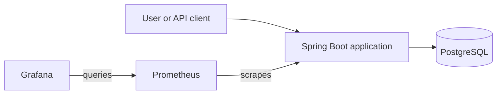

# Java Cloud Platform Lab

Java Cloud Platform Lab is a portfolio and learning project that demonstrates how a small Spring Boot application can be
developed, persisted, observed, containerized, validated, and prepared for deployment across local, Kubernetes, and AWS
environments.

The project connects a Java application with practical platform-engineering concerns including PostgreSQL, Docker,
Kubernetes, Terraform, AWS, CI, health checks, metrics, logging, and infrastructure security boundaries.

It is intentionally bounded and development-oriented rather than production-ready.

## Project status

The repository currently includes:

- a working PostgreSQL-backed Spring Boot application;
- automated application and database integration tests;
- a complete local Docker Compose environment;
- Kubernetes deployment manifests;
- Prometheus and Grafana configuration;
- GitHub Actions validation;
- Terraform-managed AWS infrastructure definitions.

The AWS Terraform configuration has been:

- formatted and validated;
- initialized against the remote S3 backend;
- planned and applied in a controlled live-verification session;
- removed after successful runtime and cleanup verification.

The live exercise confirmed ECS Fargate, the Application Load Balancer, RDS PostgreSQL, Flyway migrations, persistence
across task replacement, CloudWatch logging, security-group boundaries, zero Terraform drift, and complete teardown.

The environment is not kept running. See
[AWS Live Verification](docs/aws-live-verification.md) for the reusable deploy–verify–destroy procedure.

## Application capabilities

The application provides:

- a browser-based task board;
- a REST API for creating, reading, updating, completing, and deleting tasks;
- PostgreSQL persistence through Spring JDBC;
- Flyway database migrations;
- request validation and consistent JSON error responses;
- OpenAPI documentation and Swagger UI;
- health, readiness, and liveness endpoints;
- Prometheus-format runtime and application metrics.

## Technology stack

### Application

- Java 21
- Spring Boot 4.1
- Spring MVC
- Spring Validation
- Spring JDBC
- PostgreSQL
- Flyway
- Spring Boot Actuator
- Micrometer
- springdoc OpenAPI

### Testing

- JUnit
- Spring Boot Test
- H2
- Testcontainers PostgreSQL

### Platform

- Docker
- Docker Compose
- Kubernetes
- Prometheus
- Grafana
- GitHub Actions
- Terraform
- AWS

### AWS design

- Amazon VPC
- Application Load Balancer
- Amazon ECS Fargate
- Amazon ECR
- Amazon RDS for PostgreSQL
- AWS Secrets Manager
- AWS Identity and Access Management
- Amazon CloudWatch Logs

## Architecture overview



The same Spring Boot application is prepared for several execution targets:

| Target | Runtime | Database | Access |
|---|---|---|---|
| Direct local execution | Local JVM | Configured PostgreSQL | `localhost:8080` |
| Docker Compose | Application container | PostgreSQL container | `localhost:8080` |
| Kubernetes | Deployment and ClusterIP Service | External PostgreSQL | Cluster networking or port forwarding |
| AWS | ECS Fargate behind an Application Load Balancer | Private RDS PostgreSQL | Public HTTP load-balancer endpoint |

The AWS request path is:

```text
Internet
  -> Application Load Balancer: TCP 80
  -> ECS application: TCP 8080
  -> RDS PostgreSQL: TCP 5432
```

Detailed component relationships and trust boundaries are documented in
[Architecture](docs/architecture.md).

## Quick start

### Prerequisites

The preferred local workflow requires:

- Java 21
- Docker
- Docker Compose
- a Bash-compatible shell

### Run tests

```bash
./mvnw test
```

Docker must be available because the test suite includes a PostgreSQL Testcontainers integration test.

### Start the complete local environment

```bash
docker compose up --build
```

The main local endpoints are:

| Component | Address |
|---|---|
| Application and task board | `http://localhost:8080` |
| Swagger UI | `http://localhost:8080/swagger-ui.html` |
| OpenAPI JSON | `http://localhost:8080/v3/api-docs` |
| Prometheus | `http://localhost:9090` |
| Grafana | `http://localhost:3000` |

Local Grafana credentials:

```text
admin / admin
```

### Verify the application

```bash
curl http://localhost:8080/api/hello
curl http://localhost:8080/api/tasks
curl http://localhost:8080/actuator/health
curl http://localhost:8080/actuator/health/readiness
curl http://localhost:8080/actuator/health/liveness
```

### Stop the local environment

Preserve PostgreSQL data:

```bash
docker compose down
```

Delete the local PostgreSQL volume and task data:

```bash
docker compose down -v
```

The second command is destructive.

Detailed run, validation, troubleshooting, Kubernetes, and AWS procedures are maintained in
[Operations](docs/operations.md).

## Observability

The application exposes metrics through:

```text
/actuator/prometheus
```

The local Docker Compose environment includes:

- Prometheus scraping the application;
- a provisioned Grafana data source;
- a provisioned Grafana dashboard;
- a Prometheus application-availability alert rule;
- application-specific task API metrics.

Prometheus queries, custom metrics, alert verification, and dashboard details are documented in
[Monitoring](docs/monitoring.md).

## Kubernetes

The Kubernetes configuration defines:

- one application Deployment;
- one ClusterIP Service;
- datasource configuration through a ConfigMap and Secret;
- separate readiness and liveness probes;
- CPU and memory requests and limits.

PostgreSQL is not deployed by the Kubernetes manifests. A reachable external database must be configured before the
application can start successfully.

Operational commands are documented in [Operations](docs/operations.md).

## Terraform and AWS

The Terraform root module defines:

- VPC networking across two Availability Zones;
- public and private subnets;
- an internet-facing Application Load Balancer;
- an ECS Fargate application service;
- a private ECR repository;
- a private RDS PostgreSQL database;
- RDS-managed credentials in Secrets Manager;
- an ECS task execution role;
- CloudWatch application logging;
- security-group boundaries between the load balancer, application, and database.

The ECS tasks currently retain public IPv4 addresses for outbound AWS service access because the environment does not
include a NAT gateway or VPC endpoints.

Direct application access through those task addresses remains blocked. Application traffic is accepted only from the
load-balancer security group.

Terraform resource settings, variables, outputs, backend behavior, image publishing, bootstrap procedures, and AWS
limitations are documented in [Terraform](terraform/README.md).

## CI validation

GitHub Actions validates:

- Maven tests;
- PostgreSQL integration through Testcontainers;
- Docker image construction;
- Docker Compose configuration;
- Kubernetes manifest schemas;
- Prometheus configuration;
- Prometheus alert rules;
- Terraform formatting;
- Terraform initialization without the remote backend;
- Terraform configuration validity.

CI does not:

- authenticate to AWS;
- publish images to ECR;
- apply infrastructure;
- deploy the application.

## Current limitations

The project intentionally does not provide:

- HTTPS or a custom domain;
- AWS WAF or load-balancer authentication;
- ECS autoscaling or multiple desired tasks;
- private ECS subnets with NAT or VPC endpoints;
- Multi-AZ RDS;
- retained database backups or final snapshots;
- automated image publishing;
- automated deployment;
- a repository-managed remote Terraform state bucket;
- Kubernetes Ingress;
- Kubernetes-hosted PostgreSQL, Prometheus, or Grafana;
- production capacity planning or load testing.

These boundaries keep the repository finite, inspectable, and suitable as a focused platform-engineering portfolio
project.

## Documentation

| Document | Purpose |
|---|---|
| [Architecture](docs/architecture.md) | Component relationships, runtime topologies, trust boundaries, and design decisions |
| [Operations](docs/operations.md) | Running, validating, troubleshooting, and cleaning up environments |
| [Monitoring](docs/monitoring.md) | Metrics, Prometheus, alert rules, and Grafana |
| [Terraform](terraform/README.md) | AWS resources, variables, outputs, backend, image publishing, and infrastructure limitations |

## License

This project is licensed under the MIT License.
