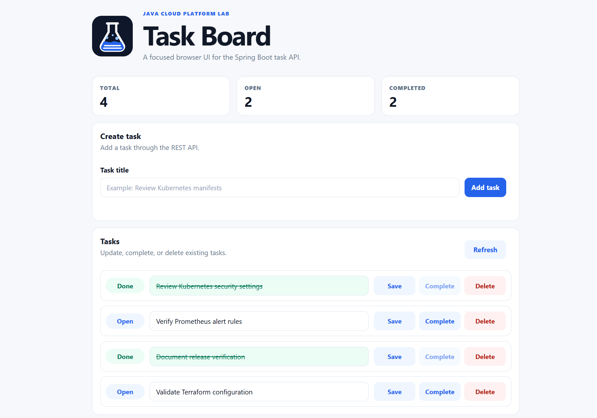
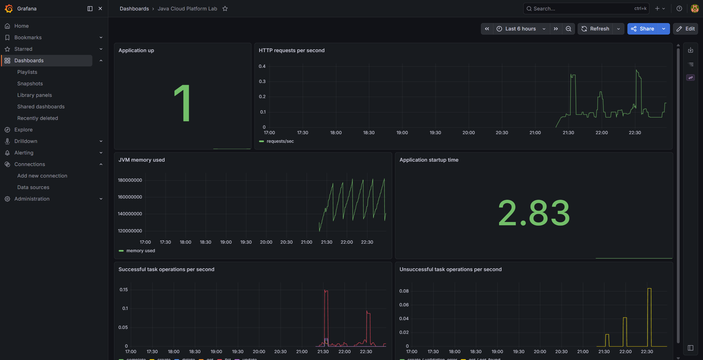
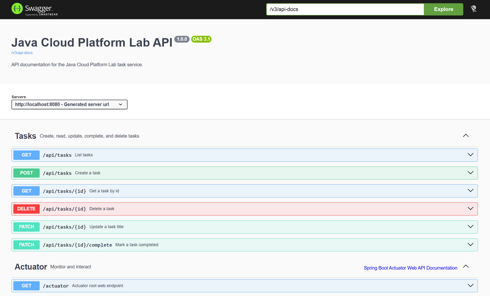
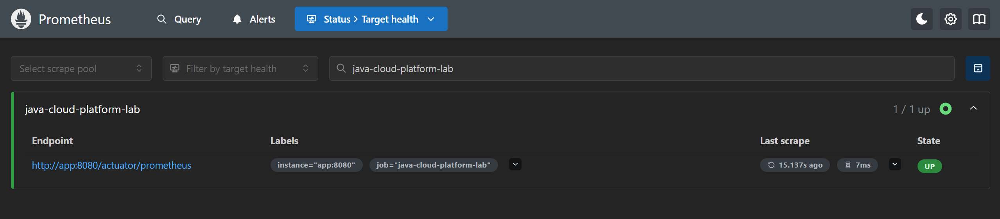
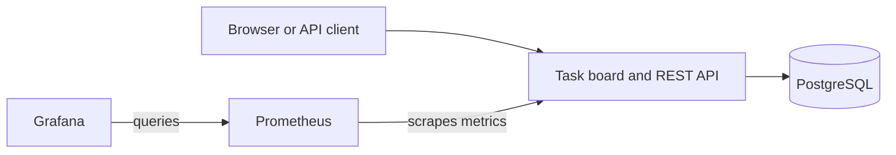

<p align="center">
  
</p>

<h1 align="center">Java Cloud Platform Lab</h1>

Java Cloud Platform Lab is a practical reference implementation for developing, persisting, observing, packaging, and
deploying a Spring Boot application across local, Kubernetes, and AWS environments. It connects application code with
PostgreSQL, containers, infrastructure as code, CI, health checks, metrics, logging, and explicit security boundaries.

The project is designed for learning and adaptation. Its runtime and infrastructure choices are intentionally bounded
and development-oriented.

## Project status

The repository currently includes:

- a working PostgreSQL-backed Spring Boot application;
- automated application and database integration tests;
- a complete local Docker Compose environment;
- Kubernetes deployment manifests;
- Prometheus and Grafana configuration;
- GitHub Actions validation;
- Terraform-managed AWS infrastructure definitions.

The AWS configuration has also been exercised in a controlled live-verification session covering the load-balanced ECS
runtime, RDS persistence, Flyway migrations, CloudWatch logging, security-group boundaries, Terraform drift, and
complete teardown. No AWS environment is kept running. See
[AWS Live Verification](docs/aws-live-verification.md) for the procedure and verification record.

## Application capabilities

The application provides:

- a browser-based task board;
- a REST API for creating, reading, updating, completing, and deleting tasks;
- PostgreSQL persistence through Spring JDBC;
- Flyway database migrations;
- request validation and consistent JSON error responses;
- OpenAPI documentation and Swagger UI;
- health, readiness, and liveness endpoints;
- Prometheus-format runtime and application metrics.

## Project tour

The local Docker Compose environment connects the task workflow with its API documentation and monitoring stack.

### Task workflow

<p align="center">
  
</p>

<p align="center"><em>Representative task states in the browser UI, backed by PostgreSQL.</em></p>

### Observability

<p align="center">
  
</p>

<p align="center"><em>Provisioned Grafana dashboard with application, JVM, HTTP, and task-operation metrics.</em></p>

<details>
<summary><strong>API documentation and Prometheus target health</strong></summary>
<br>

<p align="center">
  
</p>

<p align="center"><em>Generated OpenAPI documentation for the task service.</em></p>

<p align="center">
  
</p>

<p align="center"><em>Prometheus successfully scraping the application metrics endpoint.</em></p>

</details>

## Technology stack

| Area | Technologies |
|---|---|
| Application | Java 21, Spring Boot 4.1, Spring MVC, Validation, JDBC, Actuator, Micrometer, springdoc OpenAPI |
| Persistence | PostgreSQL, Flyway |
| Testing | JUnit, Spring Boot Test, H2, Testcontainers PostgreSQL |
| Local platform | Docker, Docker Compose, Prometheus, Grafana |
| Deployment and CI | Kubernetes, GitHub Actions, Terraform |
| AWS | VPC, Application Load Balancer, ECS Fargate, ECR, RDS, Secrets Manager, IAM, CloudWatch Logs |

## Architecture overview


```mermaid
flowchart LR
    Client[Browser or API client]
    Application[Task board and REST API]
    Database[(PostgreSQL)]
    Prometheus[Prometheus]
    Grafana[Grafana]

    Client --> Application
    Application --> Database
    Prometheus -->|scrapes metrics| Application
    Grafana -->|queries| Prometheus
```

The same Spring Boot application is prepared for several execution targets:

| Target | Runtime | Database | Access |
|---|---|---|---|
| Direct local execution | Local JVM | Configured PostgreSQL | `localhost:8080` |
| Docker Compose | Application container | PostgreSQL container | `localhost:8080` |
| Kubernetes | Deployment and ClusterIP Service | External PostgreSQL | Cluster networking or port forwarding |
| AWS | ECS Fargate behind an Application Load Balancer | Private RDS PostgreSQL | Public HTTP load-balancer endpoint |

The AWS request path is:

```text
Internet
  -> Application Load Balancer: TCP 80
  -> ECS application: TCP 8080
  -> RDS PostgreSQL: TCP 5432
```

Detailed component relationships and trust boundaries are documented in
[Architecture](docs/architecture.md).

## Quick start

### Prerequisites

The preferred local workflow requires:

- Java 21
- Docker
- Docker Compose
- a Bash-compatible shell

### Run tests

```bash
./mvnw test
```

Docker must be available because the test suite includes a PostgreSQL Testcontainers integration test.

### Start the complete local environment

```bash
docker compose up --build
```

The main local endpoints are:

| Component | Address |
|---|---|
| Application and task board | `http://localhost:8080` |
| Swagger UI | `http://localhost:8080/swagger-ui.html` |
| OpenAPI JSON | `http://localhost:8080/v3/api-docs` |
| Prometheus | `http://localhost:9090` |
| Grafana | `http://localhost:3000` |

Local Grafana credentials:

```text
admin / admin
```

### Verify the application

```bash
curl http://localhost:8080/api/tasks
curl http://localhost:8080/actuator/health
curl http://localhost:8080/actuator/health/readiness
curl http://localhost:8080/actuator/health/liveness
```

### Stop the local environment

Preserve PostgreSQL data:

```bash
docker compose down
```

Delete the local PostgreSQL volume and task data:

```bash
docker compose down -v
```

The second command is destructive.

Detailed run, validation, troubleshooting, Kubernetes, and AWS procedures are maintained in
[Operations](docs/operations.md).

## Observability

The application exposes Prometheus-format metrics at `/actuator/prometheus`. Docker Compose provisions Prometheus,
an application-availability alert rule, and a Grafana dashboard for application, JVM, HTTP, and task-operation metrics.
Queries and verification steps are documented in [Monitoring](docs/monitoring.md).

## Kubernetes

The Kubernetes manifests define one application Deployment and ClusterIP Service, externalized datasource settings,
health probes, resource constraints, and a hardened non-root security context. PostgreSQL is deliberately external to
the manifests, and the tracked Secret is an example that must be copied and populated locally before deployment.

Operational commands are documented in [Operations](docs/operations.md).

## Terraform and AWS

The Terraform root module defines two-AZ VPC networking, an internet-facing Application Load Balancer, ECS Fargate,
private ECR and RDS resources, RDS-managed credentials in Secrets Manager, an ECS execution role, CloudWatch logging,
and security-group boundaries between the load balancer, application, and database.

The ECS tasks currently retain public IPv4 addresses for outbound AWS service access because the environment does not
include a NAT gateway or VPC endpoints.

Direct application access through those task addresses remains blocked. Application traffic is accepted only from the
load-balancer security group.

Terraform resource settings, variables, outputs, backend behavior, image publishing, bootstrap procedures, and AWS
limitations are documented in [Terraform](terraform/README.md).

## CI validation

GitHub Actions validates:

- Maven tests;
- PostgreSQL integration through Testcontainers;
- Docker image construction;
- Docker Compose configuration;
- Kubernetes manifest schemas;
- Prometheus configuration;
- Prometheus alert rules;
- Markdown links and anchors;
- Terraform formatting;
- Terraform initialization without the remote backend;
- Terraform configuration validity.

CI does not:

- authenticate to AWS;
- publish images to ECR;
- apply infrastructure;
- deploy the application.

## Current scope

The project intentionally omits production edge and scaling features such as HTTPS, a custom domain, WAF, autoscaling,
Multi-AZ RDS, retained backups, and private ECS networking with managed egress. Image publishing and deployment remain
manual. The Kubernetes manifests do not include Ingress, PostgreSQL, Prometheus, or Grafana.

These boundaries keep the repository finite and make the implemented application and platform behavior straightforward
to inspect.

## Documentation

| Document | Purpose |
|---|---|
| [Architecture](docs/architecture.md) | Component relationships, runtime topologies, trust boundaries, and design decisions |
| [Operations](docs/operations.md) | Running, validating, troubleshooting, and cleaning up environments |
| [Monitoring](docs/monitoring.md) | Metrics, Prometheus, alert rules, and Grafana |
| [Terraform](terraform/README.md) | AWS resources, variables, outputs, backend behavior, and infrastructure limitations |
| [AWS Live Verification](docs/aws-live-verification.md) | Controlled AWS runtime verification and teardown record |
| [Changelog](CHANGELOG.md) | Stable release history and release highlights |

## License

This project is licensed under the MIT License.
