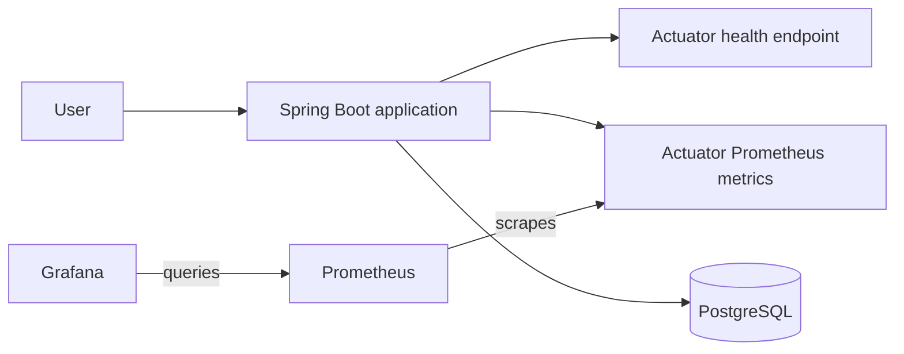
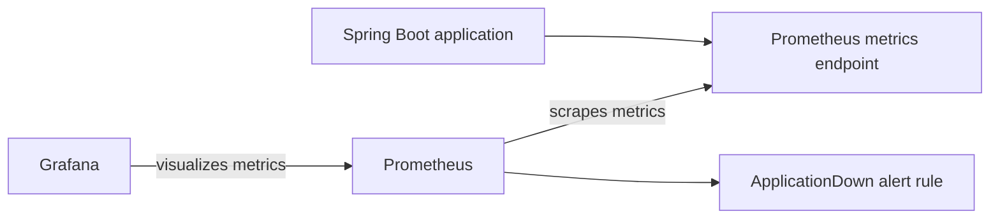
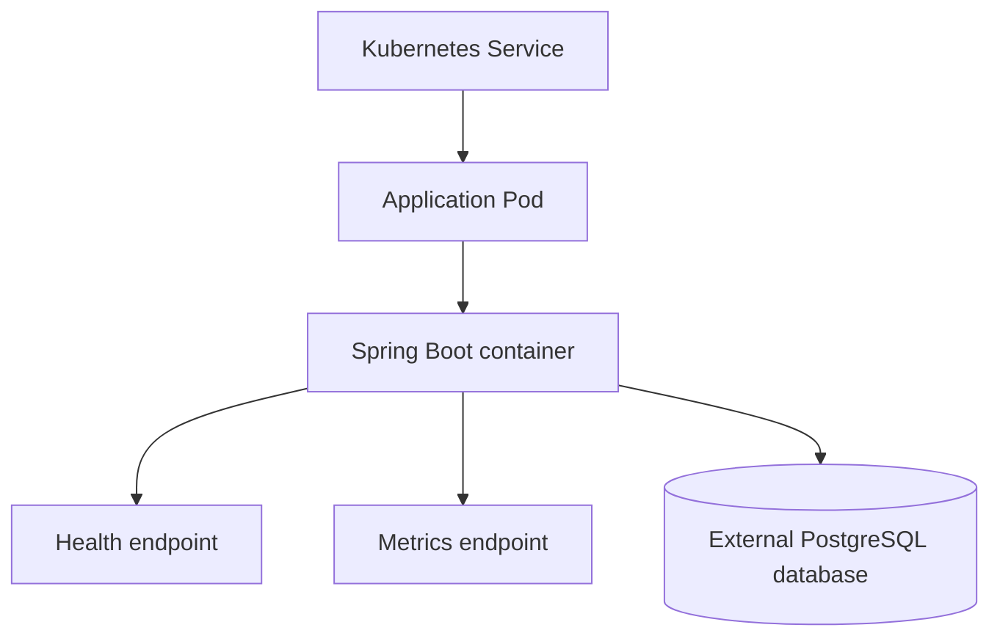
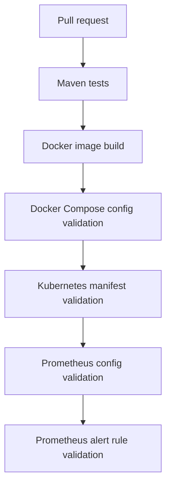

# Architecture Overview

This document gives a high-level overview of the Java Cloud Platform Lab project.

The project demonstrates a small Java service and the supporting platform practices around it: containerization, local
orchestration, database persistence, Kubernetes manifests, monitoring, alerting, and CI validation.

## Application

The application is a Spring Boot service exposing:

- A simple HTTP API
- A browser-based task board UI
- PostgreSQL-backed task persistence
- Database schema migration with Flyway
- A health endpoint through Spring Boot Actuator
- Prometheus-format metrics through Spring Boot Actuator and Micrometer

## Local runtime architecture

The local runtime uses Docker Compose to run the application, PostgreSQL, Prometheus, and Grafana together.

The application stores task data in PostgreSQL. The local Docker Compose setup uses a named PostgreSQL volume so task
data survives application container restarts.

Prometheus scrapes application metrics from the application container. Grafana uses Prometheus as its data source and
displays a provisioned dashboard.

## Database migration

The application uses Flyway to manage database schema changes.

On startup, Flyway applies SQL migrations from the application classpath before the task API starts handling requests.
The current schema includes a `tasks` table for storing task title and completion state.

The local test setup uses an H2 in-memory database with Flyway migrations enabled. This keeps the test suite lightweight
while still verifying that the application starts with a migrated schema.

## Monitoring and alerting

The local monitoring setup includes:

- Prometheus scraping the application metrics endpoint
- Grafana provisioning for the Prometheus data source
- A basic Grafana dashboard
- A local Prometheus alert rule for application scrape status

The alerting setup defines rules only. Notification delivery through Alertmanager, email, or Slack is out of scope.

## Kubernetes deployment shape

The Kubernetes manifests define a basic application deployment and service.

The deployment includes health probes and resource requests and limits.

The current Kubernetes manifests do not deploy PostgreSQL. A database must be provided separately through the
application datasource configuration.

## CI validation flow

The CI workflow validates the application and supporting platform configuration.

The Maven test suite uses a lightweight test database configuration to validate the task API and Flyway migration flow.

The goal is to catch errors early without running a full production-like environment in CI.

## Current scope

The project currently covers:

- Java application development
- PostgreSQL-backed task persistence
- Flyway database migration
- Docker image build
- Local Docker Compose runtime
- Kubernetes manifests
- Health checks
- Resource requests and limits
- Prometheus metrics
- Prometheus alert rules
- Grafana dashboard provisioning
- CI validation for application and platform configuration

## Future improvements

Possible future improvements include:

- Kubernetes-based monitoring deployment
- ServiceMonitor configuration
- More application-specific metrics
- Cloud deployment
- Managed PostgreSQL or another external database option for cloud deployments
- Infrastructure provisioning with Terraform
