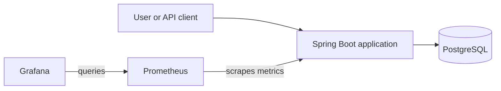
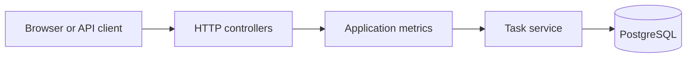
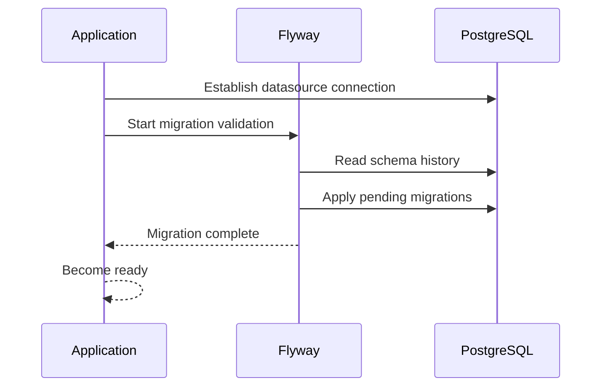
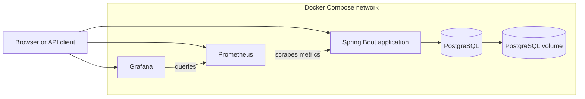
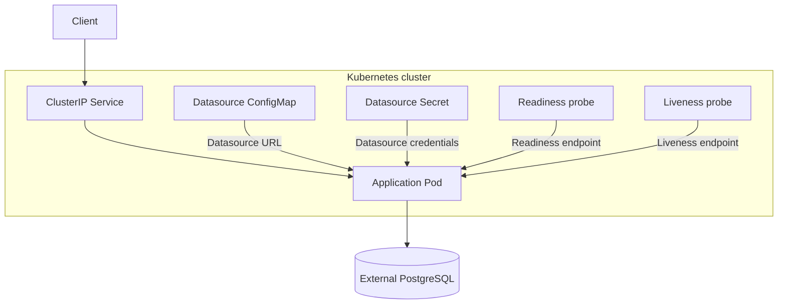
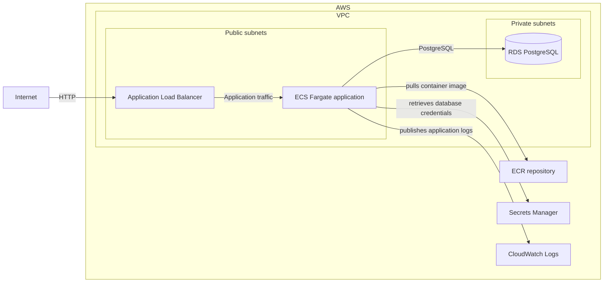
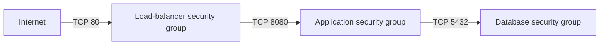
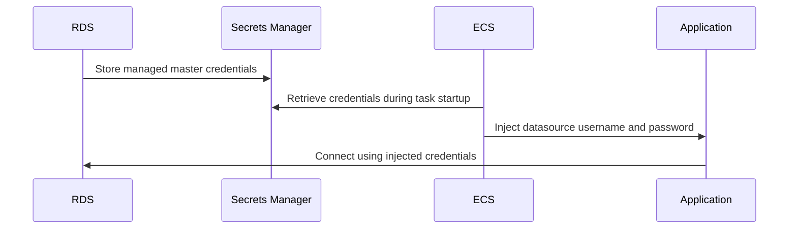
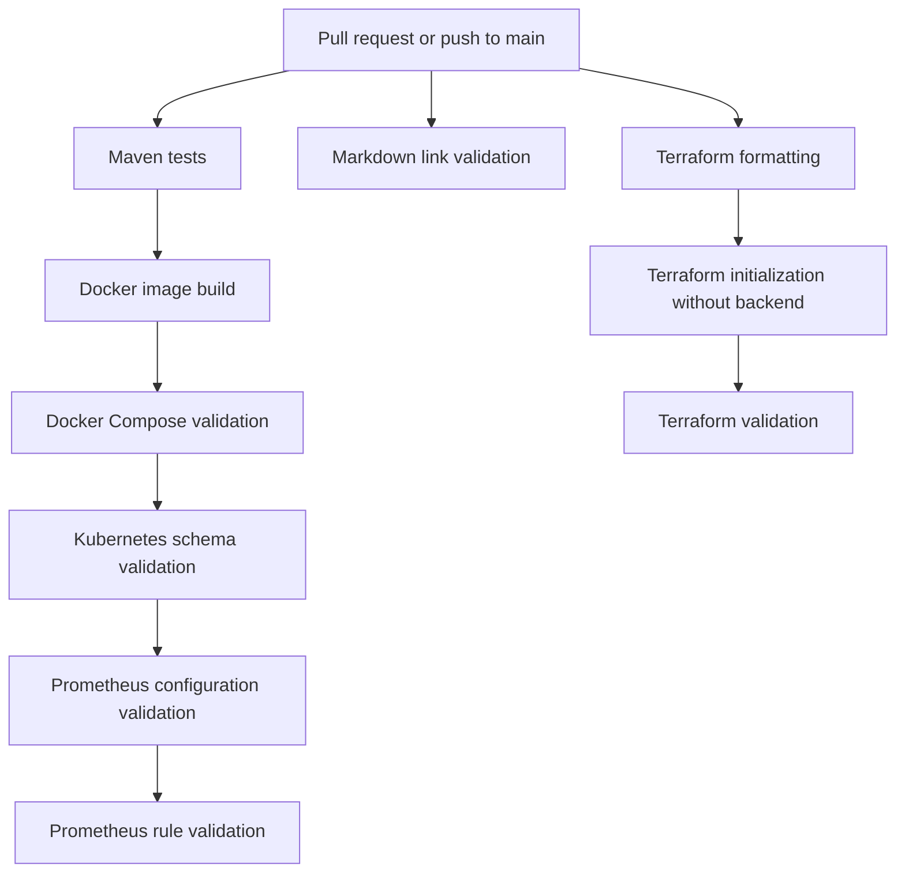

# Architecture

This document describes how the application and its supported runtime environments fit together.

It focuses on component relationships, request and data flows, trust boundaries, and design decisions. Commands and
procedures belong in [Operations](operations.md), detailed metrics and dashboards belong in
[Monitoring](monitoring.md), and resource-level Terraform guidance belongs in the
[Terraform documentation](../terraform/README.md).

## Project status

The repository contains configuration for four execution targets:

- direct local execution;
- Docker Compose;
- Kubernetes;
- Terraform-managed AWS infrastructure.

The AWS configuration has been statically validated, planned against AWS, and
verified through a controlled live deployment. The verification covered the
application runtime, PostgreSQL persistence across task replacement, CloudWatch
logging, security-group boundaries, Terraform drift, and complete teardown.

The environment was destroyed after verification and is not kept running. The
reusable procedure and historical verification record are documented in
[AWS Live Verification](aws-live-verification.md).

These terms are used consistently throughout the documentation:

| State | Meaning |
|---|---|
| Implemented | Application code or configuration exists in the repository |
| Validated | Tests or static configuration checks have passed |
| Speculatively planned | Terraform calculated intended AWS changes without creating resources |
| Live verified | Resources were temporarily created, tested in a runtime environment, and removed successfully |

The AWS design is implemented, validated, and live verified.

## System context



The Spring Boot application provides:

- a browser-based task board;
- a REST task API;
- OpenAPI documentation;
- health endpoints;
- Prometheus-format metrics.

PostgreSQL is the persistent data store for all non-test runtime environments.

Prometheus and Grafana are currently provided only by the local Docker Compose environment.

## Application structure



The application follows a small layered design:

- controllers handle HTTP routing, validation, response codes, and API documentation;
- the metrics layer records task-operation outcomes;
- the service layer performs persistence operations through Spring JDBC;
- PostgreSQL stores task state.

The task API supports create, read, update, complete, and delete operations.

Validation failures and missing resources are returned as consistent JSON error responses.

## Persistence and migrations

The application uses PostgreSQL as its runtime database.

Flyway applies versioned SQL migrations during application startup before normal request handling begins.



The test strategy uses:

- H2 for fast application and API tests;
- Testcontainers PostgreSQL for integration testing against the production-style database engine.

Both test paths use the same Flyway migrations.

## Health and observability model

The application exposes separate health concerns:

- general health;
- readiness;
- liveness;
- Prometheus-format metrics.

Readiness determines whether an instance should receive traffic.

Liveness determines whether the application process should remain running.

These concerns are intentionally separate. A temporary failure of an external dependency should not automatically cause
all application instances to restart repeatedly.

Micrometer exposes JVM, HTTP, JDBC, startup, and application-specific metrics.

Detailed metric names, Prometheus queries, alert rules, and Grafana panels are documented in
[Monitoring](monitoring.md).

## Docker Compose topology

Docker Compose provides the complete local environment.



The Compose environment contains:

- the Spring Boot application;
- PostgreSQL;
- Prometheus;
- Grafana;
- a named PostgreSQL data volume.

The application waits for PostgreSQL to pass its health check before starting.

Task data survives application-container restarts because it is stored in the PostgreSQL volume.

Prometheus and Grafana configuration is provisioned from files committed to the repository.

## Kubernetes topology

The Kubernetes manifests deploy the application but not PostgreSQL.



The Kubernetes design includes:

- one application Deployment;
- one ClusterIP Service;
- a ConfigMap for the datasource URL;
- a Secret for datasource credentials;
- separate readiness and liveness probes;
- CPU and memory requests and limits.

PostgreSQL must be reachable from the cluster through the configured datasource address.

The repository does not include:

- a Kubernetes-managed PostgreSQL instance;
- an Ingress;
- a public Kubernetes load balancer;
- Kubernetes-hosted Prometheus or Grafana.

## AWS topology

Terraform defines a development-oriented AWS architecture.



The principal AWS components are:

- an internet-facing Application Load Balancer;
- an ECS Fargate application service;
- a private RDS PostgreSQL database;
- an ECR repository;
- an RDS-managed Secrets Manager secret;
- a CloudWatch Logs group;
- supporting networking, IAM, and security groups.

Detailed Terraform variables, resource settings, outputs, backend behavior, and image-bootstrap procedures are maintained
in the [Terraform documentation](../terraform/README.md).

## Public request path

```text
Internet
  -> Application Load Balancer: TCP 80
  -> ECS application: TCP 8080
  -> RDS PostgreSQL: TCP 5432
```

The Application Load Balancer forwards public HTTP requests to the ECS service.

The target group uses the application readiness endpoint to determine whether a task is eligible to receive traffic.

## Security boundaries

The AWS design uses separate security groups for the load balancer, application, and database.



The boundaries are:

- the load-balancer security group accepts public TCP `80`;
- the application security group accepts TCP `8080` only from the load-balancer security group;
- the database security group accepts TCP `5432` only from the application security group;
- RDS is not publicly accessible.

The application port is not opened to the internet, the full VPC CIDR, or the subnet CIDRs.

## ECS public-address decision

The ECS tasks currently run in public subnets and receive public IPv4 addresses.

This is required because the environment does not include:

- a NAT gateway;
- ECR VPC endpoints;
- Secrets Manager VPC endpoints;
- CloudWatch Logs VPC endpoints.

The tasks need outbound connectivity to:

- pull images from ECR;
- retrieve database credentials;
- publish logs.

The public address does not create direct application access. The application security group permits inbound TCP `8080`
only from the load-balancer security group.

This is a cost-conscious lab design rather than a preferred production topology. A production-oriented design would
normally place application tasks in private subnets and provide controlled outbound access.

## Database credential flow

RDS generates and stores the database master credentials in Secrets Manager.



Terraform does not accept or expose the database password.

Credentials are resolved when an ECS task starts. A running task does not automatically receive a rotated secret, so a
replacement task is required after rotation.

Operational handling is documented in [Operations](operations.md).

## Logging and monitoring boundaries

Local runtime observability and AWS runtime observability are intentionally different.

### Local Docker Compose

- Prometheus scrapes application metrics.
- Grafana visualizes Prometheus data.
- Prometheus loads the local alert rule.

### AWS

- ECS sends application logs to CloudWatch Logs.
- The load balancer uses the readiness endpoint for target health.
- AWS-hosted Prometheus and Grafana are not configured.
- CloudWatch alarms and dashboards are not configured.

The repository does not claim that the local monitoring stack is deployed to AWS.

## CI validation flow



CI verifies:

- application behavior;
- PostgreSQL integration through Testcontainers;
- Docker image construction;
- Docker Compose syntax;
- Kubernetes manifest schemas;
- Prometheus configuration and rules;
- Markdown links and anchors;
- Terraform formatting and internal consistency.

CI does not:

- authenticate to AWS;
- publish images to ECR;
- deploy infrastructure;
- verify a live AWS application.

## Design boundaries

The project intentionally remains bounded.

It does not currently provide:

- HTTPS or a custom domain;
- AWS WAF or load-balancer authentication;
- ECS autoscaling or multiple desired tasks;
- private ECS subnets with NAT or VPC endpoints;
- Multi-AZ RDS;
- retained database backups or final snapshots;
- automatic image publishing;
- deployment automation;
- a live remote Terraform backend configured by the repository;
- automatic ECS redeployment after secret rotation;
- Kubernetes Ingress;
- production capacity planning or load testing.

These limitations are explicit so the repository demonstrates a coherent, inspectable design without growing into an
open-ended platform project.

## Documentation ownership

Each document has one primary responsibility:

| Document | Responsibility |
|---|---|
| [Project README](../README.md) | Portfolio overview, capabilities, quick start, and navigation |
| [Architecture](architecture.md) | Component relationships, runtime topologies, trust boundaries, and design decisions |
| [Operations](operations.md) | Commands for running, validating, troubleshooting, and cleaning up environments |
| [Monitoring](monitoring.md) | Metrics, Prometheus queries, alert rules, and Grafana dashboards |
| [Terraform](../terraform/README.md) | Terraform resources, variables, outputs, backend, image publishing, and AWS limitations |
