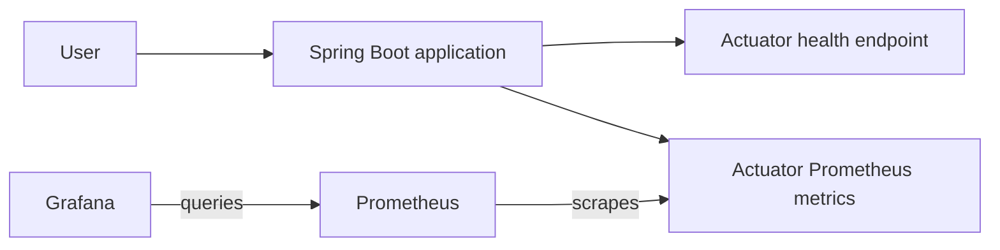
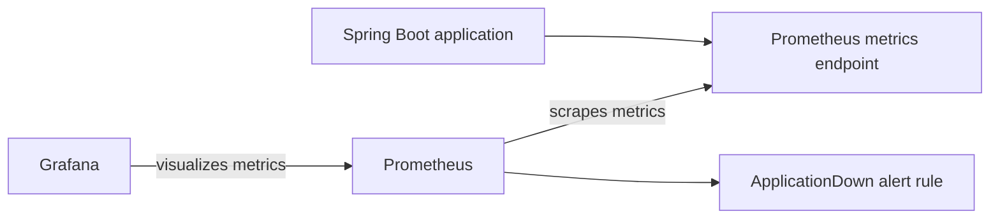
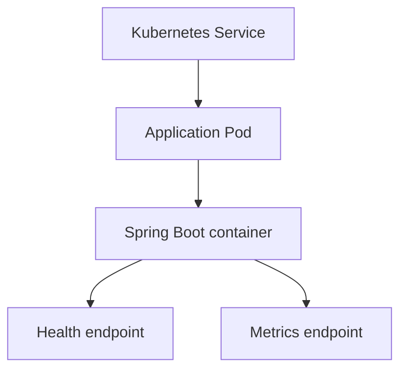
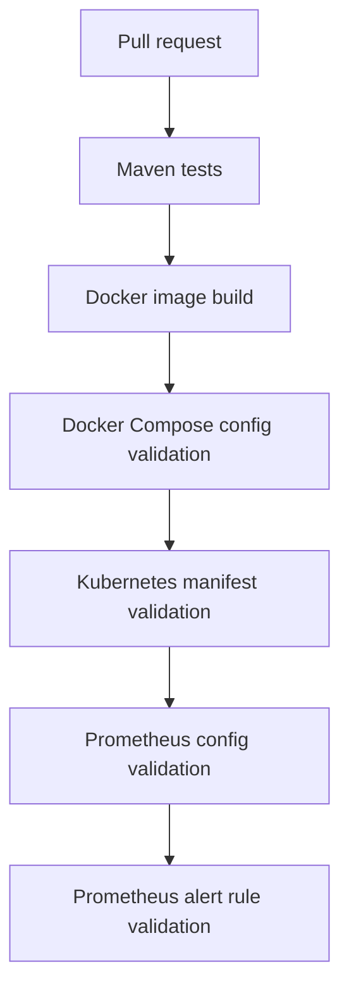

# Architecture Overview

This document gives a high-level overview of the Java Cloud Platform Lab project.

The project demonstrates a small Java service and the supporting platform practices around it: containerization, local orchestration, Kubernetes manifests, monitoring, alerting, and CI validation.

## Application

The application is a Spring Boot service exposing:

- A simple HTTP API
- A health endpoint through Spring Boot Actuator
- Prometheus-format metrics through Spring Boot Actuator and Micrometer

## Local runtime architecture

The local runtime uses Docker Compose to run the application, Prometheus, and Grafana together.

Prometheus scrapes application metrics from the application container. Grafana uses Prometheus as its data source and displays a provisioned dashboard.

## Monitoring and alerting

The local monitoring setup includes:

- Prometheus scraping the application metrics endpoint
- Grafana provisioning for the Prometheus data source
- A basic Grafana dashboard
- A local Prometheus alert rule for application scrape status

The alerting setup defines rules only. Notification delivery through Alertmanager, email, or Slack is out of scope.

## Kubernetes deployment shape

The Kubernetes manifests define a basic application deployment and service.

The deployment includes health probes and resource requests and limits.

## CI validation flow

The CI workflow validates the application and supporting platform configuration.

The goal is to catch errors early without running a full production-like environment in CI.

## Current scope

The project currently covers:

- Java application development
- Docker image build
- Local Docker Compose runtime
- Kubernetes manifests
- Health checks
- Resource requests and limits
- Prometheus metrics
- Prometheus alert rules
- Grafana dashboard provisioning
- CI validation for application and platform configuration

## Future improvements

Possible future improvements include:

- Kubernetes-based monitoring deployment
- ServiceMonitor configuration
- More application-specific metrics
- Cloud deployment
- Infrastructure provisioning with Terraform
