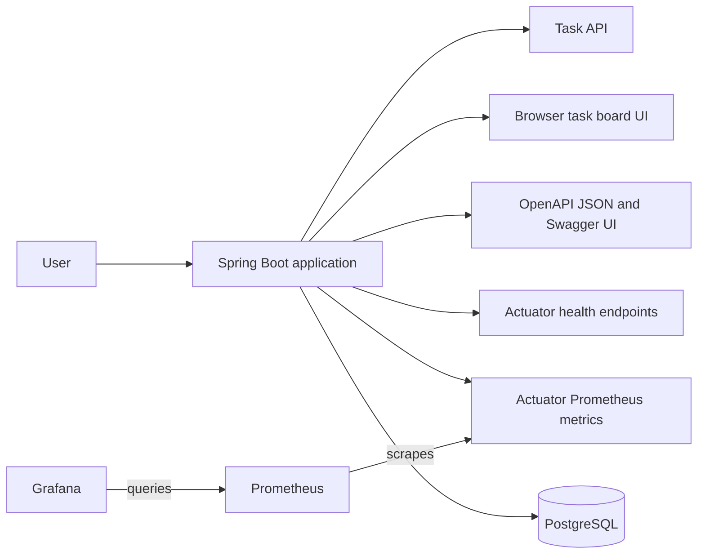
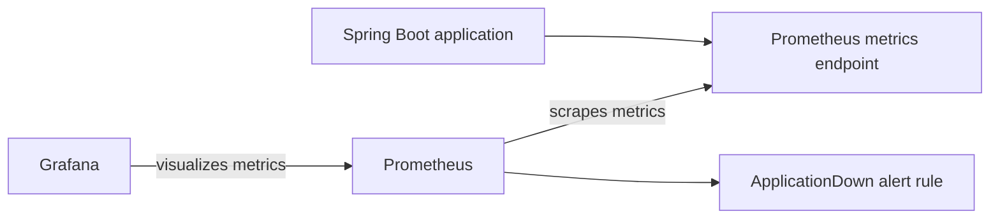
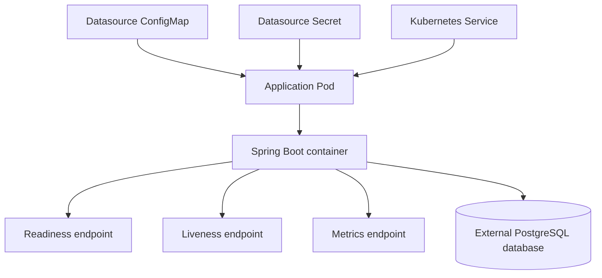
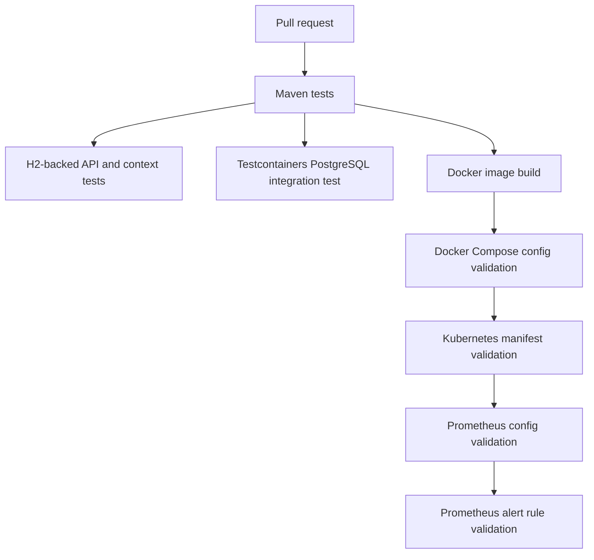

# Architecture Overview

This document gives a high-level overview of the Java Cloud Platform Lab project.

The project demonstrates a small Java service and the supporting platform practices around it: containerization, local
orchestration, database persistence, API documentation, Kubernetes manifests, monitoring, alerting, and CI validation.

## Application

The application is a Spring Boot service exposing:

* A simple HTTP API
* A browser-based task board UI
* PostgreSQL-backed task persistence
* Database schema migration with Flyway
* OpenAPI documentation and Swagger UI
* Health, readiness, and liveness endpoints through Spring Boot Actuator
* Prometheus-format metrics through Spring Boot Actuator and Micrometer

The interactive API documentation is available through Swagger UI when the application is running:

```text
http://localhost:8080/swagger-ui.html
```

The OpenAPI JSON document is available at:

```text
http://localhost:8080/v3/api-docs
```

## Local runtime architecture

The local runtime uses Docker Compose to run the application, PostgreSQL, Prometheus, and Grafana together.



The application stores task data in PostgreSQL. The local Docker Compose setup uses a named PostgreSQL volume so task
data survives application container restarts.

Prometheus scrapes application metrics from the application container. Grafana uses Prometheus as its data source and
displays a provisioned dashboard.

## API documentation

OpenAPI documentation is generated from the Spring Boot application and documents the task API endpoints, request bodies,
response bodies, validation errors, and not-found errors.

Swagger UI provides an interactive browser-based way to inspect and test the API. The OpenAPI JSON document provides a
machine-readable description of the API that can be used by tools, documentation systems, or client generators.

The OpenAPI documentation is part of the application runtime and is available through the same Spring Boot service as the
task API and Actuator endpoints.

## Database migration

The application uses Flyway to manage database schema changes.

On startup, Flyway applies SQL migrations from the application classpath before the task API starts handling requests.
The current schema includes a `tasks` table for storing task title and completion state.

The fast test setup uses an H2 in-memory database with Flyway migrations enabled. This keeps most tests lightweight while
still verifying that the application starts with a migrated schema.

The project also includes a PostgreSQL integration test using Testcontainers. This verifies the task API against a real
PostgreSQL database and provides coverage for the production-style database path.

## Monitoring and alerting

The local monitoring setup includes:

* Prometheus scraping the application metrics endpoint
* Grafana provisioning for the Prometheus data source
* A basic Grafana dashboard
* A local Prometheus alert rule for application scrape status



The alerting setup defines rules only. Notification delivery through Alertmanager, email, or Slack is out of scope.

## Kubernetes deployment shape

The Kubernetes manifests define a basic application deployment and service.



The deployment includes separate readiness and liveness probes, resource requests and limits, and datasource environment
variables.

Datasource configuration is split between:

* A ConfigMap for the datasource URL
* A Secret for the datasource username and password

The current Kubernetes manifests do not deploy PostgreSQL. A database must be provided separately through the application
datasource configuration.

## CI validation flow

The CI workflow validates the application and supporting platform configuration.



The Maven test suite combines fast H2-based tests with a PostgreSQL integration test using Testcontainers. The H2 tests
keep feedback fast for most application behavior, while the PostgreSQL integration test verifies the real database path
used by runtime environments.

The goal is to catch errors early without running a full production-like environment in CI.

## Current scope

The project currently covers:

* Java application development
* PostgreSQL-backed task persistence
* Flyway database migration
* OpenAPI documentation with Swagger UI
* PostgreSQL integration testing with Testcontainers
* Docker image build
* Local Docker Compose runtime
* Kubernetes manifests
* External datasource configuration through Kubernetes ConfigMap and Secret
* Separate readiness and liveness probes
* Resource requests and limits
* Prometheus metrics
* Prometheus alert rules
* Grafana dashboard provisioning
* CI validation for application and platform configuration

## Future improvements

Possible future improvements include:

* Kubernetes-based monitoring deployment
* ServiceMonitor configuration
* More application-specific metrics
* Cloud deployment
* Managed PostgreSQL or another external database option for cloud deployments
* Infrastructure provisioning with Terraform
