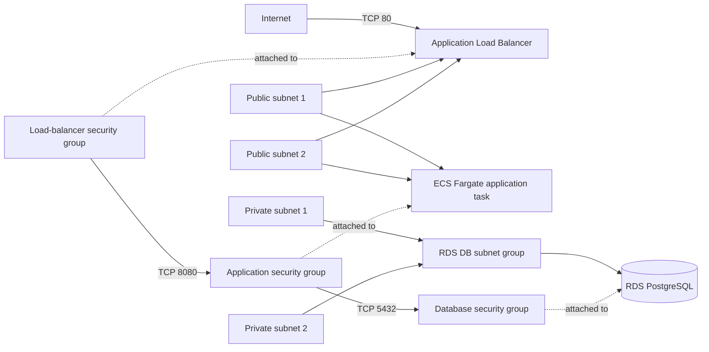

# Terraform

This directory contains the Terraform root module for the Java Cloud Platform Lab AWS infrastructure.

The current configuration establishes the Terraform and AWS provider requirements, shared input variables, resource
naming conventions, common tags, a partial Amazon S3 backend declaration, the foundational VPC network, an Amazon ECR
repository for application images, a private Amazon RDS PostgreSQL database, an Amazon ECS Fargate application service
with CloudWatch logging, and an internet-facing Application Load Balancer providing public HTTP access.

## Prerequisites

Install:

* Terraform 1.15 or a later compatible 1.x release
* AWS CLI for AWS authentication and resource operations
* Docker for building and publishing the application image

Confirm the Terraform installation:

```bash
terraform version
```

Confirm the AWS CLI installation:

```bash
aws --version
```

Confirm the Docker installation:

```bash
docker version
```

## Local configuration

Copy the example variable file:

```bash
cp terraform/terraform.tfvars.example terraform/terraform.tfvars
```

Edit `terraform/terraform.tfvars` when different local values are required.

The example configuration includes development-oriented values for:

* the AWS region
* the deployment environment
* the project name
* the immutable application image tag
* the VPC CIDR
* the PostgreSQL database name
* the PostgreSQL master username
* the RDS instance class

Set `application_image_tag` to the tag of the application image that should be deployed. In an existing environment, the
image must already be published to the Terraform-managed ECR repository before the ECS service uses it. A brand-new
environment requires the bootstrap sequence described in the container image registry section.

The local `terraform.tfvars` file is ignored by Git and must not contain committed credentials or secrets.

A database password is not accepted as a Terraform input. RDS generates and manages the master password through AWS
Secrets Manager.

## AWS credentials

Do not add AWS access keys, secret keys, or session tokens to Terraform configuration, variable files, or backend
configuration files.

The AWS provider and S3 backend can obtain credentials through standard AWS credential sources, including:

* environment variables
* the shared AWS credentials and configuration files
* container credentials
* an attached IAM role

For a locally configured AWS CLI profile, Terraform can use the profile selected through the `AWS_PROFILE` environment
variable.

Formatting, initialization without the backend, and validation do not require access to an AWS account. AWS
authentication is required when configuring the S3 backend or running operations such as `terraform plan` and
`terraform apply`.

## Network architecture

The root module defines one IPv4 VPC across two Availability Zones in the configured AWS region.

The network contains:

* two public subnets, one in each selected Availability Zone
* two private subnets, one in each selected Availability Zone
* one internet gateway
* one public route table with a default route through the internet gateway
* one private route table without an internet or NAT route
* one internet-facing Application Load Balancer across both public subnets

For the example VPC CIDR of `10.0.0.0/16`, Terraform derives these subnet ranges:

| Subnet           | CIDR           |
|------------------|----------------|
| Public subnet 1  | `10.0.0.0/24`  |
| Public subnet 2  | `10.0.1.0/24`  |
| Private subnet 1 | `10.0.10.0/24` |
| Private subnet 2 | `10.0.11.0/24` |

The public subnets have a route to the internet gateway. Automatic public IPv4 assignment is disabled, so resources must
request a public address explicitly when required.

The private subnets currently have no route outside the VPC. NAT or private service endpoints can be introduced later
when workloads require outbound connectivity from private subnets.

The ECS application tasks run in the public subnets and explicitly request public IPv4 addresses. This provides outbound
connectivity for pulling the private ECR image, retrieving the RDS-managed secret, and publishing logs to CloudWatch.

Public application requests enter through the Application Load Balancer. The ECS task public addresses do not provide
direct application access because the application security group accepts port `8080` only from the load-balancer
security group.

The VPC, subnets, internet gateway, route tables, load balancer, target group, and security groups inherit the
provider-level common tags and receive descriptive `Name` tags where supported.

## Container image registry

The root module defines one private Amazon ECR repository for the application container image.

The repository:

* enables image scanning when an image is pushed
* uses immutable image tags
* inherits the provider-level common tags
* can be removed by `terraform destroy` even when it contains images

Immutable tags prevent an existing version tag from being replaced. Use a unique image tag, such as the Git commit SHA,
for every published image.

The repository must exist before an image can be pushed. The following commands are intended for use after the Terraform
configuration has been applied.

### Obtain the repository URL

From the repository root:

```bash
ECR_REPOSITORY_URL=$(terraform -chdir=terraform output -raw ecr_repository_url)
```

Extract the registry hostname:

```bash
ECR_REGISTRY=${ECR_REPOSITORY_URL%%/*}
```

Set the AWS region to the same value used by the Terraform `aws_region` variable:

```bash
AWS_REGION=eu-central-1
```

When using a different Terraform region, replace `eu-central-1` accordingly.

### Authenticate Docker to ECR

```bash
aws ecr get-login-password --region "$AWS_REGION" \
  | docker login \
      --username AWS \
      --password-stdin "$ECR_REGISTRY"
```

The ECR authentication token is temporary, so repeat this command when the token expires.

### Select an image tag

Use the current Git commit SHA as the image version:

```bash
IMAGE_TAG=$(git rev-parse --short HEAD)
```

Verify the selected values:

```bash
echo "$ECR_REPOSITORY_URL"
echo "$IMAGE_TAG"
```

### Build the application image

```bash
docker build \
  --tag "java-cloud-platform-lab:$IMAGE_TAG" \
  .
```

### Tag the image for ECR

```bash
docker tag \
  "java-cloud-platform-lab:$IMAGE_TAG" \
  "$ECR_REPOSITORY_URL:$IMAGE_TAG"
```

### Push the image

```bash
docker push "$ECR_REPOSITORY_URL:$IMAGE_TAG"
```

Set the same published tag in `terraform/terraform.tfvars`:

```hcl
application_image_tag = "<git-commit-sha>"
```

The ECS task definition uses the resulting image reference:

```text
<ecr-repository-url>:<application-image-tag>
```

Image publishing is currently a manual operation. CI does not authenticate to AWS or push container images.

### Bootstrap a new environment

The ECR repository and ECS service are managed by the same Terraform root module. In a brand-new environment, the
repository does not exist before the first apply, so an application image cannot be published to it in advance.

Use this bootstrap sequence:

1. Keep a temporary nonblank `application_image_tag` value and apply the configuration to create the ECR repository and
   the remaining infrastructure.
2. Obtain the new repository URL and publish the application image with a unique immutable tag.
3. Replace the temporary `application_image_tag` value with the published tag.
4. Run `terraform apply` again so the ECS task definition and service use the available image.

During the interval between the two applies, ECS task launches are expected to fail because the initially referenced
image does not exist. This two-step process is limited to the first deployment of a new environment.

## PostgreSQL database

The root module defines one private Amazon RDS PostgreSQL instance for the application persistence layer.

The database configuration includes:

* PostgreSQL with no explicitly pinned engine version
* a development-oriented instance class supplied through `database_instance_class`
* 20 GiB of General Purpose SSD storage using `gp3`
* encrypted storage
* a single-AZ deployment
* no public accessibility
* no deletion protection
* no automated backup retention
* no final snapshot during deletion

These settings favor a small, disposable learning environment rather than a production database.

### Database topology

The RDS DB subnet group contains both existing private subnets across two Availability Zones.



The subnet group spans two Availability Zones so RDS has valid private placement options. The current database is
single-AZ, so the instance itself runs in one Availability Zone rather than maintaining a standby instance in the other
Availability Zone.

The database is assigned only the dedicated database security group and is not publicly accessible.

### Database credentials

RDS manages the master password through AWS Secrets Manager.

Terraform supplies the configured master username but does not supply, expose, or commit a database password. The
generated secret contains the master credentials and is identified through the `database_master_secret_arn` output.

The ECS task execution role can retrieve only this RDS-managed secret. The task definition injects:

* `SPRING_DATASOURCE_USERNAME` from the secret's `username` JSON field
* `SPRING_DATASOURCE_PASSWORD` from the secret's `password` JSON field

The secret value is not read into a Terraform output.

### Credential rotation

RDS rotates the managed master-user secret every seven days by default.

ECS resolves the secret values when a task starts. A running container does not automatically receive a new value when
the secret is rotated. After a rotation, the ECS service must launch a replacement task to read the current credentials.

A replacement task can be started with:

```bash
aws ecs update-service \
  --cluster "$(terraform -chdir=terraform output -raw ecs_cluster_name)" \
  --service "$(terraform -chdir=terraform output -raw ecs_service_name)" \
  --force-new-deployment
```

Automatic redeployment after secret rotation is not configured in this lab environment. A production implementation
should automate credential refresh and use a dedicated least-privilege application database user rather than the
database master user.

### Database access

The database security group accepts PostgreSQL connections on TCP port `5432` only from the ECS application security
group.

The application security group allows outbound traffic required for AWS service access and the database connection. Its
only inbound rule accepts TCP port `8080` from the load-balancer security group.

No public, internet-wide, VPC-wide, or subnet-wide database ingress rule is defined.

### Database lifecycle

The database is configured for straightforward lab teardown:

* automated backup retention is disabled
* `deletion_protection` is disabled
* `skip_final_snapshot` is enabled

Destroying the environment therefore removes the database without creating a final snapshot. Database data should be
treated as disposable, and this lifecycle configuration should not be reused for a production database.

## ECS Fargate application runtime

The root module defines one ECS cluster and one ECS Fargate service for the Spring Boot application.

The development-oriented task configuration uses:

* Fargate launch type
* `awsvpc` network mode
* Fargate platform version `1.4.0`
* 256 CPU units
* 512 MiB memory
* one essential application container
* container port `8080`
* one desired running task
* a 120-second load-balancer health-check grace period

The task definition uses the Terraform-managed ECR repository and the configured immutable application image tag.

### Application configuration

The datasource URL is constructed from the Terraform-managed RDS resource:

```text
jdbc:postgresql://<database-address>:<database-port>/<database-name>
```

The task definition provides the URL through `SPRING_DATASOURCE_URL` and injects the database username and password from
the RDS-managed Secrets Manager secret.

### IAM

The ECS task execution role trusts the ECS tasks service principal.

The role receives:

* the AWS-managed `AmazonECSTaskExecutionRolePolicy`
* a narrowly scoped inline policy allowing `secretsmanager:GetSecretValue` only for the RDS-managed master secret

The managed execution policy supports pulling the private ECR image and publishing container logs through the `awslogs`
log driver.

A separate application task role is not defined because the application does not currently call AWS APIs directly.

### Application networking

The ECS service runs tasks across the existing public subnets and assigns each task a public IPv4 address.

This is a temporary development-oriented networking choice because the private subnets do not currently have a NAT
gateway or VPC endpoints. Without one of those outbound paths, tasks in the private subnets could not retrieve the ECR
image, database secret, or CloudWatch Logs service endpoints.

The ECS service registers the container named `application` and port `8080` with the Application Load Balancer target
group.

The application security group accepts port `8080` only from the load-balancer security group. Consequently:

* internet clients reach the application only through the Application Load Balancer
* the application cannot be reached directly through the task's public IPv4 address
* arbitrary resources elsewhere in the VPC cannot connect to application port `8080`
* the task public IPv4 address remains an outbound-connectivity mechanism

### Application logs

The application container uses the ECS `awslogs` log driver.

Logs are sent to a Terraform-managed CloudWatch Logs group with:

* a descriptive application log-group name
* a seven-day retention period
* the configured AWS region
* an `application` log-stream prefix

CloudWatch alarms, dashboards, Container Insights, and AWS-hosted Prometheus or Grafana are not configured.

## Application Load Balancer and public access

The root module defines one internet-facing Application Load Balancer across the two public subnets.

The load balancer uses:

* IPv4
* an HTTP listener on TCP port `80`
* one HTTP target group on port `8080`
* target type `ip`
* the ECS Fargate task network interfaces as targets

### Public request path

Application traffic follows this path:

```text
Internet
  -> Application Load Balancer: TCP 80
  -> ECS application target: TCP 8080
  -> RDS PostgreSQL: TCP 5432
```

The load-balancer listener forwards every HTTP request to the application target group.

### Security groups

The load-balancer security group:

* accepts inbound TCP port `80` from `0.0.0.0/0`
* allows outbound TCP port `8080` only to the application security group

The application security group:

* accepts inbound TCP port `8080` only from the load-balancer security group
* does not accept application traffic directly from the public internet, VPC CIDR, or subnet CIDRs

The database security group continues to accept TCP port `5432` only from the application security group.

### Target-group health checks

The target group checks:

```text
/actuator/health/readiness
```

The development-oriented health-check configuration uses:

* HTTP
* expected status code `200`
* a 30-second interval
* a 5-second timeout
* two consecutive successful checks to become healthy
* three consecutive unsuccessful checks to become unhealthy

The ECS service uses a 120-second health-check grace period. During that period, ECS ignores unsuccessful
load-balancer health checks while Spring Boot, Flyway, and the datasource initialize.

The load balancer forwards user traffic only to targets that pass the readiness health check.

### Obtain the public application URL

After the infrastructure exists, retrieve the complete HTTP URL:

```bash
terraform -chdir=terraform output -raw application_url
```

The load-balancer DNS name is also available separately:

```bash
terraform -chdir=terraform output -raw load_balancer_dns_name
```

The current public endpoint uses HTTP only. No custom domain, TLS certificate, HTTPS listener, or HTTP-to-HTTPS redirect
is configured.

## Outputs

The root module exposes:

* `vpc_id`
* `public_subnet_ids`
* `private_subnet_ids`
* `ecr_repository_url`
* `database_endpoint`
* `database_port`
* `database_name`
* `database_master_secret_arn`
* `ecs_cluster_name`
* `ecs_service_name`
* `application_log_group_name`
* `load_balancer_dns_name`
* `application_url`

Subnet IDs are returned in position order.

The ECR repository URL is used when tagging, publishing, and deploying the application image.

The database endpoint contains the RDS DNS address without the port. The port is exposed separately through
`database_port`.

The database master-secret ARN identifies the RDS-managed Secrets Manager secret. It does not expose the secret value.

The ECS cluster and service outputs identify the application runtime resources. The application log-group output
identifies the CloudWatch Logs group that receives the application container logs.

The load-balancer DNS output contains the AWS-generated hostname. The application URL adds the current `http://` scheme
to that hostname.

## Remote state

The root module contains a partial Amazon S3 backend declaration. The repository does not contain a real bucket name or
activate the remote backend automatically.

Before using the S3 backend, its bucket must already exist. The bucket should have:

* versioning enabled so previous state versions can be recovered
* public access blocked
* server-side encryption enabled
* access restricted to the users and automation that manage this infrastructure

Each environment should use a distinct state key. For example:

```text
java-cloud-platform-lab/dev/terraform.tfstate
java-cloud-platform-lab/staging/terraform.tfstate
java-cloud-platform-lab/prod/terraform.tfstate
```

Backend configuration cannot reference Terraform input variables or locals. It is supplied separately during
initialization.

Copy the example backend configuration:

```bash
cp terraform/backend.s3.tfbackend.example terraform/backend.s3.tfbackend
```

Edit `terraform/backend.s3.tfbackend` and replace the placeholder bucket name and any environment-specific settings.

The local `.tfbackend` file is ignored by Git. It must not contain credentials or secrets.

After the state bucket is available, initialize the backend from the repository root:

```bash
terraform -chdir=terraform init \
  -reconfigure \
  -backend-config=backend.s3.tfbackend
```

Do not run this command with the placeholder example values. Creating the bucket and migrating any existing state are
separate tasks.

## State locking

The example backend configuration enables S3-native state locking:

```hcl
use_lockfile = true
```

Terraform uses a lock file in the S3 bucket to prevent concurrent operations from writing the same state.

DynamoDB-based state locking is not used.

The S3 state lock file is unrelated to `.terraform.lock.hcl`:

* the S3 lock file protects remote state from concurrent modification
* `.terraform.lock.hcl` records selected provider versions and package checksums

## Format the configuration

From the repository root:

```bash
terraform -chdir=terraform fmt -recursive
```

Verify formatting:

```bash
terraform -chdir=terraform fmt -check -recursive
```

## Initialize without the remote backend

Local validation and CI can initialize Terraform without configuring or contacting the S3 backend:

```bash
terraform -chdir=terraform init \
  -backend=false \
  -input=false \
  -lockfile=readonly
```

Initialization downloads the required provider and uses the committed `.terraform.lock.hcl` without modifying it.

The dependency lock file is intentionally committed so provider-version selections and checksum changes can be reviewed.

The generated `.terraform/` working directory must not be committed.

## Validate the configuration

```bash
terraform -chdir=terraform validate -no-color
```

Validation checks that the configuration is syntactically valid and internally consistent. It does not provision or
modify infrastructure.

The network, ECR, RDS, IAM, ECS, load-balancer, target-group, listener, security-group, and CloudWatch Logs resources
are created only when `terraform apply` is run with valid AWS credentials.

## Current limitations

The current Terraform configuration intentionally contains:

* no NAT gateway or NAT instance
* no VPC endpoints
* ECS tasks in public subnets with public IPv4 addresses for outbound connectivity
* public application access over HTTP only
* no custom domain, TLS certificate, HTTPS listener, or HTTP-to-HTTPS redirect
* no AWS WAF
* no authentication at the load balancer
* no ECS service autoscaling
* no multiple-task deployment
* no separate application task IAM role
* no ECS Exec
* no Container Insights
* no CloudWatch alarms or dashboards
* no AWS-hosted Prometheus or Grafana
* no automatic ECS redeployment after RDS master-secret rotation
* a two-step application-image bootstrap for the first deployment of a new environment
* no custom network ACLs
* no IPv6 configuration
* no Multi-AZ database deployment
* no automated database backups or final snapshots
* no automated image-publishing workflow
* no automated application deployment workflow
* no state-bucket provisioning
* no active remote-state configuration
* no state migration
* no modules
* no environment-specific directories

Final project-wide architecture and operations documentation will be introduced through a separate follow-up change.
