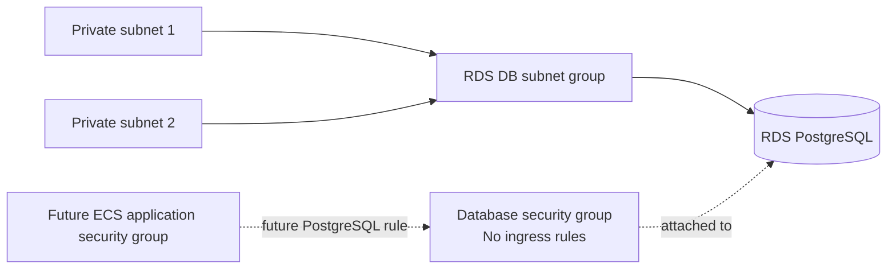

# Terraform

This directory contains the Terraform root module for the Java Cloud Platform Lab AWS infrastructure.

The current configuration establishes the Terraform and AWS provider requirements, shared input variables, resource
naming conventions, common tags, a partial Amazon S3 backend declaration, the foundational VPC network, an Amazon ECR
repository for application images, and a private Amazon RDS PostgreSQL database.

## Prerequisites

Install:

* Terraform 1.15 or a later compatible 1.x release
* AWS CLI for AWS authentication and resource operations
* Docker for building and publishing the application image

Confirm the Terraform installation:

```bash
terraform version
```

Confirm the AWS CLI installation:

```bash
aws --version
```

Confirm the Docker installation:

```bash
docker version
```

## Local configuration

Copy the example variable file:

```bash
cp terraform/terraform.tfvars.example terraform/terraform.tfvars
```

Edit `terraform/terraform.tfvars` when different local values are required.

The example configuration includes development-oriented values for:

* the AWS region
* the deployment environment
* the project name
* the VPC CIDR
* the PostgreSQL database name
* the PostgreSQL master username
* the RDS instance class

The local `terraform.tfvars` file is ignored by Git and must not contain committed credentials or secrets.

A database password is not accepted as a Terraform input. RDS generates and manages the master password through AWS
Secrets Manager.

## AWS credentials

Do not add AWS access keys, secret keys, or session tokens to Terraform configuration, variable files, or backend
configuration files.

The AWS provider and S3 backend can obtain credentials through standard AWS credential sources, including:

* environment variables
* the shared AWS credentials and configuration files
* container credentials
* an attached IAM role

For a locally configured AWS CLI profile, Terraform can use the profile selected through the `AWS_PROFILE` environment
variable.

Formatting, initialization without the backend, and validation do not require access to an AWS account. AWS
authentication is required when configuring the S3 backend or running operations such as `terraform plan` and
`terraform apply`.

## Network architecture

The root module defines one IPv4 VPC across two Availability Zones in the configured AWS region.

The network contains:

* two public subnets, one in each selected Availability Zone
* two private subnets, one in each selected Availability Zone
* one internet gateway
* one public route table with a default route through the internet gateway
* one private route table without an internet or NAT route

For the example VPC CIDR of `10.0.0.0/16`, Terraform derives these subnet ranges:

| Subnet           | CIDR           |
|------------------|----------------|
| Public subnet 1  | `10.0.0.0/24`  |
| Public subnet 2  | `10.0.1.0/24`  |
| Private subnet 1 | `10.0.10.0/24` |
| Private subnet 2 | `10.0.11.0/24` |

The public subnets have a route to the internet gateway. Automatic public IPv4 assignment is disabled, so resources must
request a public address explicitly when required.

The private subnets currently have no route outside the VPC. NAT or private service endpoints can be introduced later
when workloads require outbound connectivity.

The VPC, subnets, internet gateway, and route tables inherit the provider-level common tags and receive descriptive
`Name` tags.

## Container image registry

The root module defines one private Amazon ECR repository for the application container image.

The repository:

* enables image scanning when an image is pushed
* uses immutable image tags
* inherits the provider-level common tags
* can be removed by `terraform destroy` even when it contains images

Immutable tags prevent an existing version tag from being replaced. Use a unique image tag, such as the Git commit SHA,
for every published image.

The repository must exist before an image can be pushed. The following commands are intended for use after the Terraform
configuration has been applied.

### Obtain the repository URL

From the repository root:

```bash
ECR_REPOSITORY_URL=$(terraform -chdir=terraform output -raw ecr_repository_url)
```

Extract the registry hostname:

```bash
ECR_REGISTRY=${ECR_REPOSITORY_URL%%/*}
```

Set the AWS region to the same value used by the Terraform `aws_region` variable:

```bash
AWS_REGION=eu-central-1
```

When using a different Terraform region, replace `eu-central-1` accordingly.

### Authenticate Docker to ECR

```bash
aws ecr get-login-password --region "$AWS_REGION" \
  | docker login \
      --username AWS \
      --password-stdin "$ECR_REGISTRY"
```

The ECR authentication token is temporary, so repeat this command when the token expires.

### Select an image tag

Use the current Git commit SHA as the image version:

```bash
IMAGE_TAG=$(git rev-parse --short HEAD)
```

Verify the selected values:

```bash
echo "$ECR_REPOSITORY_URL"
echo "$IMAGE_TAG"
```

### Build the application image

```bash
docker build \
  --tag "java-cloud-platform-lab:$IMAGE_TAG" \
  .
```

### Tag the image for ECR

```bash
docker tag \
  "java-cloud-platform-lab:$IMAGE_TAG" \
  "$ECR_REPOSITORY_URL:$IMAGE_TAG"
```

### Push the image

```bash
docker push "$ECR_REPOSITORY_URL:$IMAGE_TAG"
```

The resulting image reference can later be used by the ECS task definition:

```text
<ecr-repository-url>:<git-commit-sha>
```

Image publishing is currently a manual operation. CI does not authenticate to AWS or push container images.

## PostgreSQL database

The root module defines one private Amazon RDS PostgreSQL instance for the application persistence layer.

The database configuration includes:

* PostgreSQL with no explicitly pinned engine version
* a development-oriented instance class supplied through `database_instance_class`
* 20 GiB of General Purpose SSD storage using `gp3`
* encrypted storage
* a single-AZ deployment
* no public accessibility
* no deletion protection
* no automated backup retention
* no final snapshot during deletion

These settings favor a small, disposable learning environment rather than a production database.

### Database topology

The RDS DB subnet group contains both existing private subnets across two Availability Zones.



The subnet group spans two Availability Zones so RDS has valid private placement options. The current database is
single-AZ, so the instance itself runs in one Availability Zone rather than maintaining a standby instance in the other
Availability Zone.

The database is assigned only the dedicated database security group and is not publicly accessible.

### Database credentials

RDS manages the master password through AWS Secrets Manager.

Terraform supplies the configured master username but does not supply, expose, or commit a database password. The
generated secret contains the master credentials and is identified through the `database_master_secret_arn` output.

The later ECS infrastructure will grant its task execution role permission to retrieve the managed secret and will
provide the database connection settings to the application.

### Current database access

The database security group intentionally has no inbound rules.

Consequently, the database cannot currently accept application connections, including connections from other resources
inside the VPC. The later ECS infrastructure will add a PostgreSQL ingress rule that allows port `5432` only from the
application security group.

No public, internet-wide, or VPC-wide database ingress rule is defined.

### Database lifecycle

The database is configured for straightforward lab teardown:

* automated backup retention is disabled
* `deletion_protection` is disabled
* `skip_final_snapshot` is enabled

Destroying the environment therefore removes the database without creating a final snapshot. Database data should be
treated as disposable, and this lifecycle configuration should not be reused for a production database.

## Outputs

The root module exposes:

* `vpc_id`
* `public_subnet_ids`
* `private_subnet_ids`
* `ecr_repository_url`
* `database_endpoint`
* `database_port`
* `database_name`
* `database_master_secret_arn`

Subnet IDs are returned in position order.

The ECR repository URL is used when tagging, publishing, and later deploying the application image.

The database endpoint contains the RDS DNS address without the port. The port is exposed separately through
`database_port`.

The database master-secret ARN identifies the RDS-managed Secrets Manager secret. It does not expose the secret value.

## Remote state

The root module contains a partial Amazon S3 backend declaration. The repository does not contain a real bucket name or
activate the remote backend automatically.

Before using the S3 backend, its bucket must already exist. The bucket should have:

* versioning enabled so previous state versions can be recovered
* public access blocked
* server-side encryption enabled
* access restricted to the users and automation that manage this infrastructure

Each environment should use a distinct state key. For example:

```text
java-cloud-platform-lab/dev/terraform.tfstate
java-cloud-platform-lab/staging/terraform.tfstate
java-cloud-platform-lab/prod/terraform.tfstate
```

Backend configuration cannot reference Terraform input variables or locals. It is supplied separately during
initialization.

Copy the example backend configuration:

```bash
cp terraform/backend.s3.tfbackend.example terraform/backend.s3.tfbackend
```

Edit `terraform/backend.s3.tfbackend` and replace the placeholder bucket name and any environment-specific settings.

The local `.tfbackend` file is ignored by Git. It must not contain credentials or secrets.

After the state bucket is available, initialize the backend from the repository root:

```bash
terraform -chdir=terraform init \
  -reconfigure \
  -backend-config=backend.s3.tfbackend
```

Do not run this command with the placeholder example values. Creating the bucket and migrating any existing state are
separate tasks.

## State locking

The example backend configuration enables S3-native state locking:

```hcl
use_lockfile = true
```

Terraform uses a lock file in the S3 bucket to prevent concurrent operations from writing the same state.

DynamoDB-based state locking is not used.

The S3 state lock file is unrelated to `.terraform.lock.hcl`:

* the S3 lock file protects remote state from concurrent modification
* `.terraform.lock.hcl` records selected provider versions and package checksums

## Format the configuration

From the repository root:

```bash
terraform -chdir=terraform fmt -recursive
```

Verify formatting:

```bash
terraform -chdir=terraform fmt -check -recursive
```

## Initialize without the remote backend

Local validation and CI can initialize Terraform without configuring or contacting the S3 backend:

```bash
terraform -chdir=terraform init \
  -backend=false \
  -input=false \
  -lockfile=readonly
```

Initialization downloads the required provider and uses the committed `.terraform.lock.hcl` without modifying it.

The dependency lock file is intentionally committed so provider-version selections and checksum changes can be reviewed.

The generated `.terraform/` working directory must not be committed.

## Validate the configuration

```bash
terraform -chdir=terraform validate -no-color
```

Validation checks that the configuration is syntactically valid and internally consistent. It does not provision or
modify infrastructure.

The network, ECR, and RDS resources are created only when `terraform apply` is run with valid AWS credentials.

## Current limitations

The current Terraform configuration intentionally contains:

* no NAT gateway or NAT instance
* no VPC endpoints
* no application or load-balancer security groups
* no database ingress rule
* no custom network ACLs
* no IPv6 configuration
* no load balancer or compute resources
* no Multi-AZ database deployment
* no automated database backups or final snapshots
* no automated image-publishing workflow
* no state-bucket provisioning
* no active remote-state configuration
* no state migration
* no modules
* no environment-specific directories
* no deployment workflow

Application access to PostgreSQL, ECS compute, load balancing, and final cloud deployment documentation will be
introduced through separate follow-up changes.
